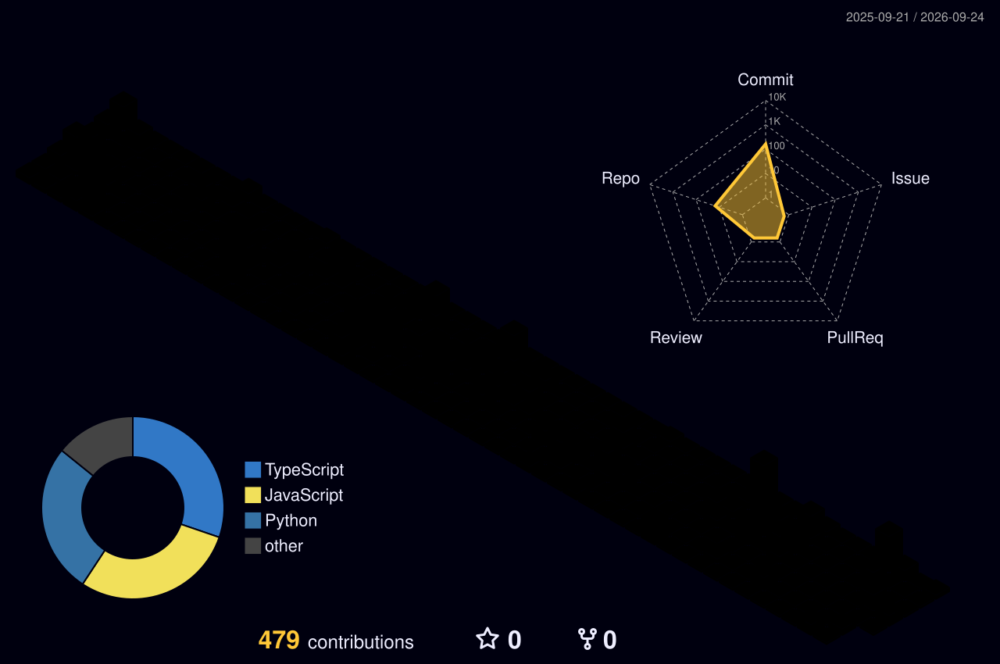

<div align="center">


</div>

<br>

## 👋 About Me

I'm **Ganesh Amaraneni**, a Web Developer who enjoys turning ideas into fast, reliable, production-ready products. I work across the stack — from building UI in **React** to wiring up backend services, real-time systems, and the infrastructure that keeps them running.

Since **February 2026**, I've been working in industry at a private company, where I build and maintain real-world systems used in production — not just side projects.

```yaml
current_focus:    "Real-time apps, automation pipelines & clean API architecture"
currently_working_at: "Private Company (Feb 2026 – Present)"
reach_me:         "LinkedIn ↓"
fun_fact:         "I'd rather automate it once than do it manually twice 🤖"
```

<br>

## 🚀 What I Bring

<table>
<tr>
<td width="50%" valign="top">

**🔌 API & Frontend Engineering**
- Built and integrated **50+ REST/third-party API integrations** across projects
- Shipped multiple production-grade **React** frontend applications
- Component-driven architecture, state management, and performance-focused UI builds

**⚡ Real-Time Systems**
- Hands-on with **WebSockets** for live, bidirectional data flow
- Built real-time audio/video features using **LiveKit**

</td>
<td width="50%" valign="top">

**🛠️ DevOps & Infrastructure**
- Containerized applications with **Docker**
- Built and maintained **CI/CD pipelines** for automated testing & deployment
- Managed domains, DNS, and **Cloudflare** configuration (proxying, caching, security rules)
- Experience with **API bypass / access & rate-limit handling** techniques

**🤖 Data & Automation**
- Built **web scraping** pipelines for structured data extraction
- Designed automation scripts to eliminate repetitive manual work

</td>
</tr>
</table>

<br>

## 🧰 Tech Stack

<div align="center">


</div>

<br>

## 📊 GitHub Stats

<div align="center">


</div>

<br>

## 🌐 3D Contribution Graph

<div align="center">

<!-- This block is populated automatically by the GitHub Action in profile-3d-contrib.yml -->


</div>

<br>

## 🐍 Contribution Snake

<div align="center">

<!-- This block is populated automatically by the GitHub Action in snake.yml -->


</div>

<br>

## 💼 Featured Projects

<table>
<tr>
<td width="50%">

### 🎥 Real-Time Video/Audio Platform
Live audio-video communication app built with **LiveKit** and **WebSockets** for low-latency real-time interaction.

`React` `WebSockets` `LiveKit` `Node.js`

**[🔗 View Repo →](https://github.com/Ganesh-Amaraneni/your-livekit-project)**

</td>
<td width="50%">

### 🔌 API Integration Hub
A backend service unifying **50+ third-party API integrations** into a single, consistent interface for downstream apps.

`Node.js` `Express` `REST APIs` `MongoDB`

**[🔗 View Repo →](https://github.com/Ganesh-Amaraneni/your-api-hub-project)**

</td>
</tr>
<tr>
<td width="50%">

### 🕷️ Web Scraper & Automation Suite
Automated scraping and data pipeline tooling with scheduling, retries, and structured storage.

`Python/Node.js` `Web Scraping` `Automation` `Docker`

**[🔗 View Repo →](https://github.com/Ganesh-Amaraneni/your-scraper-project)**

</td>
<td width="50%">

### ☁️ Domain & Cloudflare Manager
A dashboard for managing domains, DNS records, and Cloudflare configs (caching, proxy rules, security).

`Cloudflare API` `Docker` `CI/CD` `React`

**[🔗 View Repo →](https://github.com/Ganesh-Amaraneni/your-cloudflare-project)**

</td>
</tr>
</table>

<div align="center">
<sub>📌 Replace the repo links above with your actual project URLs.</sub>
</div>

<br>

## 📫 Connect With Me

<div align="center">

<a href="https://www.linkedin.com/in/your-linkedin-username/" target="_blank">
  
</a>

</div>

<br>


<div align="center">

</div>
