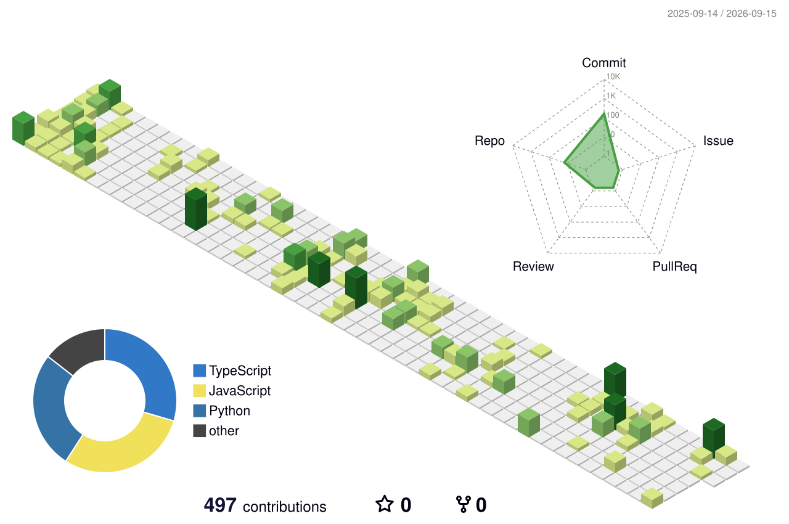

<div align="center">


</div>

<br>

## About Me

I'm **Ganesh**, a Web Developer and always a student who wants to learn new things and apply them.

Since **February 2026**, I've been working in a company, where I build and maintain real-world systems used in production - not just side projects.

```yaml
current_focus:    "Real-time apps, automation pipelines & clean API architecture"
working since:    "Feb 2026 - Present"
reach_me:         "LinkedIn ↓"
```

<br>

## What I Bring

<table>
<tr>
<td width="50%" valign="top">

**API & Frontend Engineering**
- Built and integrated **50+ REST/third-party API integrations** across projects
- Shipped multiple production-grade **React** frontend applications
- Component-driven architecture, state management, and performance-focused UI builds

**Real-Time Systems**
- Hands-on with **WebSockets** for live, bidirectional data flow
- Built real-time audio/video features using **LiveKit**

</td>
<td width="50%" valign="top">

**DevOps & Infrastructure**
- Containerized applications with **Docker**
- Built and maintained **CI/CD pipelines** for automated testing & deployment
- Managed domains, DNS, and **Cloudflare** configuration (proxying, caching, security rules)
- Experience with **API bypass / access & rate-limit handling** techniques

**Data & Automation**
- Built **web scraping** pipelines for structured data extraction
- Designed automation scripts to eliminate repetitive manual work

</td>
</tr>
</table>

<br>

## Skills

**Languages & Frontend**
<p align="left">
  
  
  
  
  
</p>

**Backend & Real-Time**
<p align="left">
  
  
  
  
</p>

**DevOps, Cloud & Platforms**
<p align="left">
  
  
  
  
  
  
  
</p>

**Tools & Analytics**
<p align="left">
  
  
  
</p>

<br>

## GitHub Stats

<div align="center"> <!-- This block is populated automatically by the GitHub Action in metrics.yml -->  </div> <br>


## 3D Contribution Graph

<div align="center">



</div>

<br>

## Contribution Snake

<div align="center">


</div>

<br>

## Featured Projects

<table>
<tr>
<td width="50%">

### Real-Time Video/Audio Platform
Live audio-video communication app built with **LiveKit** and **WebSockets** for low-latency real-time interaction.

`React` `WebSockets` `LiveKit` `Node.js`

**[View Repo →](https://github.com/amaraneniganesh/your-livekit-project)**

</td>
<td width="50%">

### API Integration Hub
A backend service unifying **50+ third-party API integrations** into a single, consistent interface for downstream apps.

`Node.js` `Express` `REST APIs` `MongoDB`

**[View Repo →](https://github.com/amaraneniganesh/your-api-hub-project)**

</td>
</tr>
<tr>
<td width="50%">

### Web Scraper & Automation Suite
Automated scraping and data pipeline tooling with scheduling, retries, and structured storage.

`Python/Node.js` `Web Scraping` `Automation` `Docker`

**[View Repo →](https://github.com/amaraneniganesh/your-scraper-project)**

</td>
<td width="50%">

### Domain & Cloudflare Manager
A dashboard for managing domains, DNS records, and Cloudflare configs (caching, proxy rules, security).

`Cloudflare API` `Docker` `CI/CD` `React`

**[View Repo →](https://github.com/amaraneniganesh/your-cloudflare-project)**

</td>
</tr>
</table>

<br>

## Connect With Me

<div align="center">

<a href="https://www.linkedin.com/in/amaraneniganesh/" target="_blank">
  
</a>

</div>

<br>


<div align="center">

</div>
